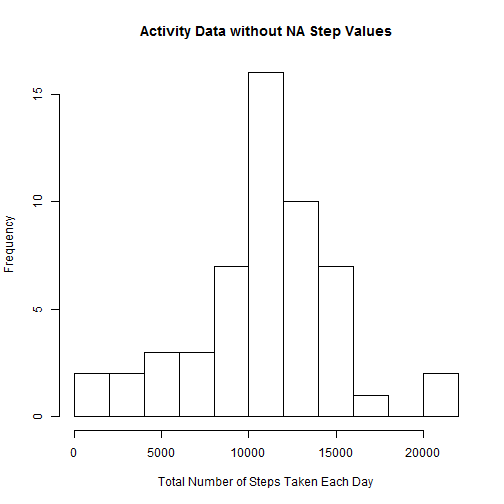
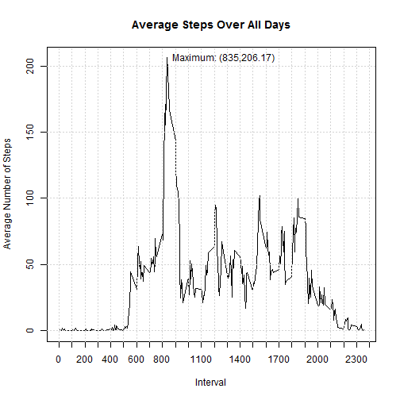
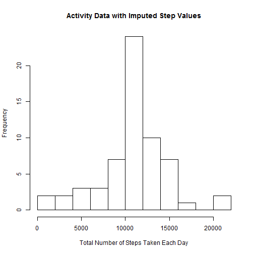
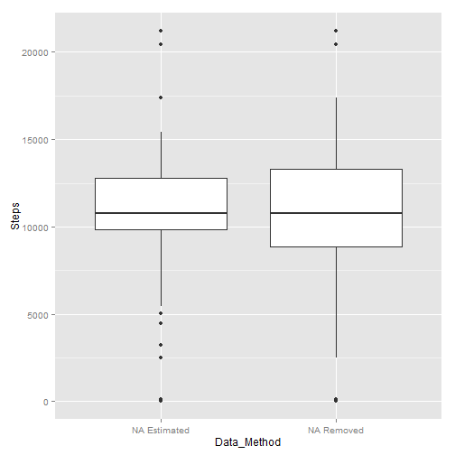
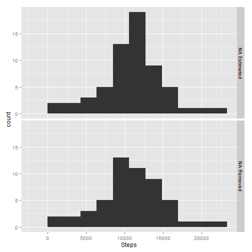
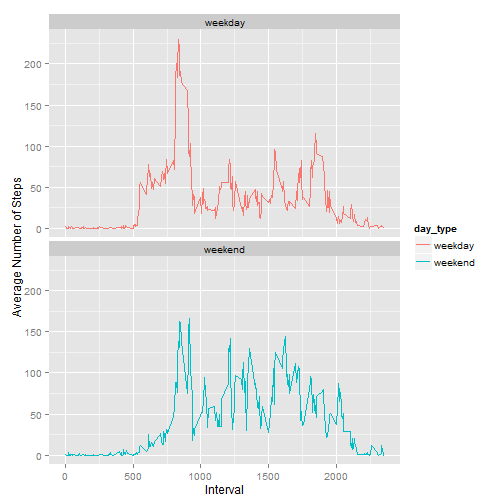
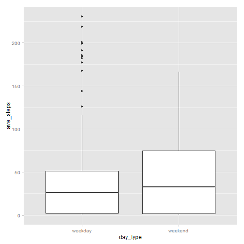

## Loading and preprocessing the data
Read the activity data into a dataframe. Display the headings and the number of rows.

```r
df_activity_data <- read.csv("activity.csv",stringsAsFactors=FALSE)
colnames(df_activity_data)
```

```
## [1] "steps"    "date"     "interval"
```

```r
nrow(df_activity_data)
```

```
## [1] 17568
```
Remove the rows with NA's in any column using the complete.cases function. Display the resulting number of rows.

```r
idx_full <- complete.cases(df_activity_data)
df_activity_data_complete <- df_activity_data[idx_full,]
nrow(df_activity_data_complete)
```

```
## [1] 15264
```

## What is mean total number of steps taken per day?
### 1. Make a histogram of the total number of steps taken each day

Summarize the total number of steps using the dplyr summarize function.

```r
library(dplyr)
by_date <- df_activity_data_complete %>% group_by(date)
tot_steps_by_date <- by_date %>% summarize(tot_steps=sum(steps))
tot_steps <- tot_steps_by_date$tot_steps
hist(tot_steps, breaks=10,
  xlab="Total Number of Steps Taken Each Day",
    main="Activity Data without NA Step Values")
```

 

### 2. Calculate and report the **mean** and **median** total number of steps taken per day

```r
mean_steps <- mean(tot_steps)
median_steps <- median(tot_steps)

cat("The MEAN total number of steps per day without the NA step values is:"
    , mean_steps,"\n",
    "The MEDIAN total number of steps per day without the NA step values is:"
    , median_steps,"\n")
```

```
## The MEAN total number of steps per day without the NA step values is: 10766.19 
##  The MEDIAN total number of steps per day without the NA step values is: 10765
```

## What is the average daily activity pattern?
Make a time series plot (i.e. type = "l") of the 5-minute interval (x-axis) and the average number of steps taken, averaged across all days (y-axis)

Which 5-minute interval, on average across all the days in the dataset, contains the maximum number of steps?


```r
library(dplyr)
by_interval <- df_activity_data_complete %>% group_by(interval)
steps_by_interval <- by_interval %>% summarize(tot_steps=sum(steps),ave_steps=mean(steps))
plot(ave_steps ~ interval, data=steps_by_interval, type="l", 
     xlab="Interval", ylab="Average Number of Steps", main="Average Steps Over All Days", 
     lab=c(24,6,6))
grid()
idx_max <-which.max(steps_by_interval$ave_steps)
max_steps_int <- steps_by_interval$interval[idx_max]
max_steps_count <- steps_by_interval$ave_steps[idx_max]

text(max_steps_int,max_steps_count,paste0("Maximum: (",max_steps_int,",",round(max_steps_count,2),")"),pos=4)
```

 

```r
cat("The maximum number of steps averaged over the days is:",
    max_steps_count, ", which occurs at interval:", max_steps_int)
```

```
## The maximum number of steps averaged over the days is: 206.1698 , which occurs at interval: 835
```

## Imputing missing values
Make a histogram of the total number of steps taken each day and Calculate and report the mean and median total number of steps taken per day. Do these values differ from the estimates from the first part of the assignment? What is the impact of imputing missing data on the estimates of the total daily number of steps?

Calculate the number of rows with NA values for each column.

```r
names(df_activity_data)
```

```
## [1] "steps"    "date"     "interval"
```

```r
num_na_steps <- sum(is.na(df_activity_data$steps))
num_na_steps
```

```
## [1] 2304
```

```r
num_na_intervals <- sum(is.na(df_activity_data$interval))
num_na_intervals
```

```
## [1] 0
```

```r
num_na_dates <- sum(is.na(df_activity_data$date))
num_na_dates
```

```
## [1] 0
```

Some of the values in the step column have NA values.

Calculate an estimated value for those NA values by using the average value for that interval from the
data set that doesn't contain NA values.
These average values were calculated earlier and are available in the data frame called tot_steps_by_interval


```r
# Make a lookup table for the imputed values
default_steps <- steps_by_interval$ave_steps
names(default_steps)<- steps_by_interval$interval

# Find the missing step value indices
idx_na <- which(is.na(df_activity_data))

# Look up the default step values using the associated interval as a key
imputed_steps <- sapply(idx_na,function(i) default_steps[as.character(df_activity_data$interval[i])])

# Store the imputed values in a new data frame
df_activity_data_imputed <- df_activity_data
df_activity_data_imputed$steps[idx_na]=imputed_steps

# Verify that there are no more NA values
num_na_steps <- sum(is.na(df_activity_data_imputed$steps))
num_na_steps
```

```
## [1] 0
```

Now analyze the data set with the NA step values filled in with the average values

```r
by_date_imp <- df_activity_data_imputed %>% group_by(date)
tot_steps_by_date_imp <- by_date_imp %>% summarize(tot_steps=sum(steps))
tot_steps_imp <- tot_steps_by_date_imp$tot_steps
hist(tot_steps_imp, breaks=10,
  xlab="Total Number of Steps Taken Each Day",
    main="Activity Data with Imputed Step Values")
```

 


Compare the data sets before and after imputing the missing data.

```r
library(ggplot2)

dat <- data.frame(Steps = c(tot_steps_imp,tot_steps),
                  Data_Method = c(
                    rep("NA Estimated",length(tot_steps_imp)),
                     rep("NA Removed",length(tot_steps))))

qplot(Data_Method, Steps, data = dat, geom = "boxplot")
```

 

```r
bwidth=max(tot_steps)/10
qplot(Steps, data = dat, facets = Data_Method ~ ., binwidth = bwidth)
```

 

### 2. Calculate and report the **mean** and **median** total number of steps taken per day using imputed step values


```r
mean_steps_imp <- mean(tot_steps_imp)
median_steps_imp <- median(tot_steps_imp)

cat("The MEAN total number of steps per day using the imputed step values is:"
    , mean_steps_imp,"\n",
    "The MEDIAN total number of steps per day using the imputed step values is:"
    , median_steps_imp,"\n")
```

```
## The MEAN total number of steps per day using the imputed step values is: 10766.19 
##  The MEDIAN total number of steps per day using the imputed step values is: 10766.19
```

## Are there differences in activity patterns between weekdays and weekends?
For this part the weekdays() function may be of some help here. Use the dataset with the filled-in missing values for this part.

Create a new factor variable in the dataset with two levels: "weekday"" and "weekend" indicating whether a given date is a weekday or weekend day.

Make a panel plot containing a time series plot (i.e. type = "l") of the 5-minute interval (x-axis) and the average number of steps taken, averaged across all weekday days or weekend days (y-axis). See the README file in the GitHub repository to see an example of what this plot should look like using simulated data.

Make a new column in the data set with the day type: weekday or weekend

```r
wkdays <- weekdays(as.POSIXct(df_activity_data_imputed$date))
idx_weekend<- wkdays=="Saturday" | wkdays=="Sunday"

library(dplyr)

# Make a column with the identification of weekday vs. weekend
day_type <- rep("weekday",nrow(df_activity_data_imputed))
day_type[idx_weekend] <- "weekend"
df_activity_data_imputed$day_type <- as.factor(day_type)
```

Create a summary with the average number of steps for each type of day.

```r
df_weekday <- filter(df_activity_data_imputed, day_type=="weekday")
df_weekend <- filter(df_activity_data_imputed, day_type=="weekend")

wd_by_interval <- df_weekday %>% group_by(interval)
wd_steps_by_interval <- wd_by_interval %>% summarize(tot_steps=sum(steps),ave_steps=mean(steps))

we_by_interval <- df_weekend %>% group_by(interval)
we_steps_by_interval <- we_by_interval %>% summarize(tot_steps=sum(steps),ave_steps=mean(steps))
```

Make a data frame for plotting with the day type and the average steps.


```r
we_steps_by_interval$day_type<-"weekend"
wd_steps_by_interval$day_type<-"weekday"

df_compare_stack <- rbind(wd_steps_by_interval, we_steps_by_interval)
```

Compare the activity pattern on weekdays and weekends by plotting steps in 
each interval for each group.

```r
ggplot(data=df_compare_stack, aes(x=interval, y = ave_steps, colour = day_type)) + 
  geom_line() + facet_wrap(~day_type, ncol=1) + labs(x="Interval") + labs(y="Average Number of Steps")
```

 

Also compare the weekend vs. weekday average steps using boxplots.

```r
qplot(day_type, ave_steps, data = df_compare_stack, geom = "boxplot")
```

 
